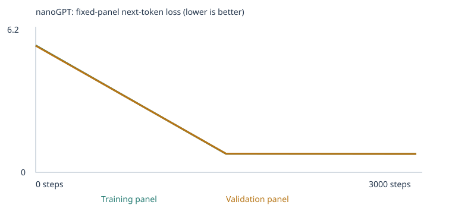

# Custom LLM — Class 4

A tiny word-level nanoGPT (2 blocks, 4 heads, 64-dimensional embeddings, 48-token
context) trained twice on a CPU laptop: once on the supplied classroom corpus, and
once on that corpus plus ~1,900 teaching sentences I wrote for three of the
extension eval categories. Both runs are scored against the same unchanged 48-case
eval suite before and after training.

**Headline result.** Adding focused teaching material moved the all-case score from
**20/48 to 30/48**. Every one of that gain came from the three categories I taught
(`grammar`, `opposites`, `categories_and_analogies`): all nine of those cases were
*unscorable* in the starter run because their words did not exist in the model's
136-token vocabulary, and all nine are correct after the extension. The five
extension categories I did **not** teach are still 0/15 and still unscorable. Adding
data bought vocabulary coverage and three narrow patterns — it did not make the
model better at language.

| experiment | stage | all-case | scorable accuracy | coverage | starter_patterns | starter_transfer | extend_corpus |
| --- | --- | --- | --- | --- | --- | --- | --- |
| A — starter corpus | untrained | 9/48 (18.8%) | 9/24 (37.5%) | 24/48 (50.0%) | 6/16 | 3/8 | 0/24 (0 scorable) |
| A — starter corpus | **trained** | **20/48 (41.7%)** | 20/24 (83.3%) | 24/48 (50.0%) | **16/16** | 4/8 | 0/24 (0 scorable) |
| B — extended corpus | untrained | 13/48 (27.1%) | 13/33 (39.4%) | 33/48 (68.8%) | 5/16 | 5/8 | 3/24 (9 scorable) |
| B — extended corpus | **trained** | **30/48 (62.5%)** | 30/33 (90.9%) | 33/48 (68.8%) | **16/16** | 5/8 | **9/24 (9 scorable)** |

Result sets: [A untrained](llm_runs/20260921T170450_805820Z/language_evals/untrained/) ·
[A trained](llm_runs/20260921T170450_805820Z/language_evals/final/) ·
[B untrained](llm_runs/20260921T171153_136482Z/language_evals/untrained/) ·
[B trained](llm_runs/20260921T171153_136482Z/language_evals/final/)

Executed notebooks: [Experiment A](notebooks/custom_llm_starter_executed.ipynb) ·
[Experiment B](notebooks/custom_llm_extended_executed.ipynb) (B is also the state of
[`custom_llm.ipynb`](custom_llm.ipynb))

> These 48 cases are public and I used them to choose what to teach, so they are a
> **development benchmark**, not an unseen test. A claim about generalisation to new
> material would need tests that never guided my choices.

---

## Credit

The notebook, eval suite, runner and chat script come from
[pepealonso95/custom-llm](https://github.com/pepealonso95/custom-llm); the upstream
README is kept at [docs/upstream-README.md](docs/upstream-README.md). `nanogpt_model.py`
is Andrej Karpathy's [nanoGPT](https://github.com/karpathy/nanoGPT) `model.py` at commit
`3adf61e`, unmodified, under the [MIT licence](NANOGPT_LICENSE). I did not modify
`nanogpt_model.py`, `run_evals.py`, `chat.py` or `evals/language_evals.json` — the
notebook verifies their SHA-256 checksums on every run and would refuse to start if I had.

What I added: [`scripts/make_teaching_corpus.py`](scripts/make_teaching_corpus.py),
[`scripts/verify_separation.py`](scripts/verify_separation.py),
[`scripts/embedding_neighbours.py`](scripts/embedding_neighbours.py), the three
[`corpus/`](corpus/) teaching files, and this README.

## How to run it

Python 3.11–3.13. Training both experiments takes about 11 seconds each on an Apple M3 Pro.

```bash
uv venv --python 3.13 .venv
uv pip install --python .venv/bin/python -r requirements.txt ipykernel nbconvert numpy
```

Then either open the notebook and *Run All*:

```bash
./.venv/bin/jupyter lab custom_llm.ipynb
```

or execute it headlessly, which is how both experiments in this repository were produced:

```bash
./.venv/bin/jupyter nbconvert --to notebook --execute --inplace --ExecutePreprocessor.timeout=3600 custom_llm.ipynb
```

Each *Run All* writes a fresh timestamped folder and ZIP under `llm_runs/`.
To reproduce **Experiment A**, empty `corpus/` of the three `.md` files first. To
reproduce **Experiment B**, regenerate them (the generator is deterministic):

```bash
./.venv/bin/python scripts/make_teaching_corpus.py
```

There is also a Colab route — [open `custom_llm.ipynb` in
Colab](https://colab.research.google.com/github/kunaalwb1902/custom-llm-class4/blob/main/custom_llm.ipynb) —
but note that opening a GitHub notebook in Colab does **not** copy `corpus/`, so the
Colab run reproduces Experiment A unless you upload the three teaching files into
`/content/corpus` first.

### Rerunning the evals on the saved weights

The eval runner only does inference; it never updates weights. It re-derives all 48
results from a saved `model.pt`:

```bash
./.venv/bin/python run_evals.py --model llm_runs/20260921T171153_136482Z/model.pt --output results/my-final-evals
```

Add `--stage untrained` and point at `model_untrained.pt` for the before-training set.
I did this for all four result sets; every one reproduced the notebook's numbers
**and all 48 per-case rows byte-for-byte**, with matching `model_sha256` and
`suite_sha256`. Those reruns are in [`results/rerun/`](results/rerun/).

### Launching the chat interface

```bash
./.venv/bin/python chat.py --model llm_runs/20260921T171153_136482Z/model.pt --transcript results/my-chat.json
```

Type a prompt, press Return, read the continuation, type another; `/quit` exits.
`--transcript` must be a filename that does not exist yet, so an earlier conversation
cannot be overwritten. The notebook's Section 10 is the in-notebook equivalent (edit
`CHAT_PROMPT`, rerun the cell).

---

## My three choices

| choice | value | why |
| --- | --- | --- |
| Corpus | `CORPUS="classroom"`; Experiment B adds 3 files in `corpus/` | The classroom generator already covers eight domains well; the extension categories need vocabulary and patterns it has none of, so I added focused files rather than replacing the corpus. `folder`-only mode would have thrown away the domain patterns that score 16/16. |
| Training steps | 3,000 | The assignment's suggested budget, and identical across both runs so the only difference is the data. A 10-step run first confirmed the pipeline. The loss curve is flat well before 3,000 (see below), so more steps would not have helped either run. |
| Learning rate | 0.001 | The suggested starting value, with the notebook's warmup and cosine decay. Too large an update overshoots the minimum and the loss diverges or oscillates instead of settling; too small and 3,000 steps are not enough to leave the near-uniform initial predictions — the untrained loss of ~5.7 is roughly ln(283), which is what "no idea, all words equally likely" costs. |

### Corpus sources and permissions

Every training sentence is either generated by the notebook's own
`classroom_corpus()` function or written by me in
[`scripts/make_teaching_corpus.py`](scripts/make_teaching_corpus.py). No third-party
text, no PDFs, no scraped material, nothing confidential or personal — so there is
nothing to get permission for, and the corpus is committed to this repository rather
than git-ignored. Because there were no PDFs there was no text-extraction step to
check and `corpus_manifest.json` records **no extraction warnings** for either run:
all three files are UTF-8 Markdown and imported cleanly (438, 1,147 and 349 passages).

The files deliberately contain **no Markdown syntax**. Markdown is read as plain
text, so a `# Heading` line would become the training tokens `#` and `heading` and
waste vocabulary on formatting.

### Corpus, vocabulary and split

| | Experiment A (starter) | Experiment B (extended) |
| --- | --- | --- |
| run folder | [`20260921T170450_805820Z`](llm_runs/20260921T170450_805820Z/) | [`20260921T171153_136482Z`](llm_runs/20260921T171153_136482Z/) |
| imported files | 0 | 3 (`grammar.md`, `opposites.md`, `categories.md`) |
| new unique passages from files | 0 | 1,934 |
| unique passages (after dedup) | 4,592 | 6,526 |
| train / validation split (90/10) | 4,132 / 460 | 5,873 / 653 |
| reserved eval passages removed before the split | 160 | 160 |
| vocabulary size | 136 | 283 |
| training unknown-token rate | 0.00% | 0.00% |
| held-out unknown-token rate | 0.00% | 0.00% |
| omitted token types (over the 509 cap) | 0 | 0 |
| parameters | 111,872 | 121,280 |
| completed steps / elapsed | 3,000 / 10.03 s | 3,000 / 10.56 s |
| hardware | Apple M3 Pro, CPU, macOS 14.6, Python 3.13.15, torch 2.14.0 | same |

Manifests: [A](llm_runs/20260921T170450_805820Z/corpus_manifest.json) ·
[B](llm_runs/20260921T171153_136482Z/corpus_manifest.json). Vocabulary reports:
[A](llm_runs/20260921T170450_805820Z/vocabulary_report.json) ·
[B](llm_runs/20260921T171153_136482Z/vocabulary_report.json).
Configs: [A](llm_runs/20260921T170450_805820Z/config.json) ·
[B](llm_runs/20260921T171153_136482Z/config.json).

Both unknown-token rates are 0.00% in both runs, and no token type was dropped —
the 509-type cap never bound, because even the extended vocabulary is only 283 types.
That is also why the starter run scores zero on every extension case: not because the
model is bad at opposites, but because words like `cold`, `salmon` and `walked` are
not in its 136-word vocabulary at all.

The split is by deduplicated **passage**, not by source file, so held-out passages
share templates with training passages. It tests whether the model learned the
templates, not whether it generalises to new kinds of text.

---

## What I expected, and what actually happened

To be straight about provenance: this list was written up after both runs, so treat
it as "what I was designing for" rather than a sealed prediction. Expectations 2 and
3 are the ones with real pre-run evidence — the corpus generator was built around
them before Experiment B existed, and its comments say so in the committed source
([why every distractor word had to be taught](scripts/make_teaching_corpus.py), and
the decision to teach three categories rather than eight).

1. *The starter run will do well on `starter_patterns` and much worse on
   `starter_transfer`, because the transfer cases rearrange the same words into
   sentence shapes the templates never produce.*
   **Right.** 16/16 versus 4/8.
2. *The starter run will score 0 on all 24 extension cases, and most will be
   unscorable rather than wrong.*
   **Right, and more completely than I expected** — all 24 were unscorable, so the
   model was never even asked for a probability.
3. *The extension will fix the three categories I teach and do nothing for the other
   five.* **Right:** 9/9 on the taught categories, 0/15 and still unscorable on the rest.
4. *Validation loss will be higher than training loss and both will be much higher
   in Experiment B, because the corpus is more varied.*
   **Half right.** B's loss is indeed higher (0.828 vs 0.678) — but in B the
   validation loss ended up *below* the training loss (0.823 vs 0.828), which I had
   not predicted. Both panels are only 20 documents, so a gap that small is noise,
   not evidence that the model generalises better than it fits.
5. *Adding ~30% new data will cost some starter-pattern accuracy.*
   **Wrong.** `starter_patterns` stayed at 16/16 and `starter_transfer` actually
   improved from 4/8 to 5/8.

Experiment A was run and saved before the teaching corpus was written, so its
numbers could not have been tuned after the fact; the two run folders' timestamps
(`…T170450Z` and `…T171153Z`) and their `config.json` files record the order.

---

## Loss curves



*(Experiment B. Experiment A's curve is
[here](llm_runs/20260921T170450_805820Z/training_curves.svg).)*

These are the **fixed evaluation panels**: at most 20 training documents and at most
20 validation documents, sampled once with fixed seeds and reused at every
measurement, averaging the loss over non-padding next-token targets. They are small
estimates, not full-corpus measurements. Both panels held 20 documents in both runs.

Complete measured values, from [`history.json`](llm_runs/20260921T171153_136482Z/history.json)
([A](llm_runs/20260921T170450_805820Z/history.json)) — this is every row, not a selection:

| step | A training | A validation | B training | B validation |
| --- | --- | --- | --- | --- |
| 0 | 4.9263 | 4.9275 | 5.6671 | 5.6520 |
| 1500 | 0.6821 | 0.7182 | 0.8282 | 0.8320 |
| 3000 | 0.6783 | 0.7061 | 0.8277 | 0.8232 |

Per-step batch losses are in [`training.csv`](llm_runs/20260921T171153_136482Z/training.csv)
([A](llm_runs/20260921T170450_805820Z/training.csv)); summaries in
[`training_summary.json`](llm_runs/20260921T171153_136482Z/training_summary.json).

Almost all the learning happens before step 1,500: A moves 4.93 → 0.68 by step 1,500
and then only 0.68 → 0.678 over the next 1,500 steps. The two runs' losses are **not
comparable to each other** — different corpora and different vocabularies mean
different numbers of things to be uncertain about. B starts higher (ln 283 ≈ 5.65 vs
ln 136 ≈ 4.91) for exactly that reason.

Falling training loss on its own would not show generalisation. Here validation loss
falls with it, but the validation passages come from the same templates as the
training passages, so that only shows the templates were learned.

---

## Samples: untrained → halfway → final

Same generation settings throughout (temperature 0.8, fixed seed). All four saved
samples at each step, nothing omitted — Experiment B,
[`samples/`](llm_runs/20260921T171153_136482Z/samples/):

**Step 0 (untrained)** — first two of four:
```
soft a nurse professor they hot on chick quality banana tree opposite opposite a course on copper care lamb brand in desk iron time tuna compared physician understand professor treatment educator walk
desk data understand walked returned cool silk mentioned full mortgage crow investment website order sparrow birds ducks ducks design something doors apple cotton nurse software grows price item duck heavy quiet program
```

**Step 1500 (halfway)**:
```
we learned about the new investment during a discussion of risk .
a review of return helped us understand the new credit .
a review of patient helped us understand the different doctor .
our school has a question about the new educator and course .
```

**Step 3000 (final)**:
```
we learned about the new investment during a discussion of risk .
a review of return helped us understand the new credit .
a review of patient helped us understand the different doctor .
our school has a question about the local instructor and course .
```

The visible change is between step 0 and step 1,500, and there are two parts to it.
At step 0 the output is a uniform random draw from the vocabulary: no articles before
nouns, no sentence-ending `.`, no agreement, and it runs to the 32-token limit because
it never produces `<EOS>`. By step 1,500 every sample is a grammatical, correctly
punctuated sentence that stops on its own.

The change between step 1,500 and step 3,000 is almost nothing — three of the four
samples are *identical*, and the fourth changes one adjective (`new educator` →
`local instructor`). That matches the loss table: the model had essentially finished
learning by the halfway point, and it is also a warning. These sentences are
template completions, and the model is producing the templates it was trained on.
Fluency here is not knowledge.

---

## Tracing one word through the model

Full detail: [`tokenization.json`](llm_runs/20260921T171153_136482Z/tokenization.json) and
[`inspection.json`](llm_runs/20260921T171153_136482Z/inspection.json) (Experiment B).

**Text → tokens → IDs.** The tokenizer lowercases and splits punctuation into its own
token, so `.` is a word like any other. The training document

```
the new mortgage was mentioned in the interest report yesterday .
```

becomes the 11 tokens `['the','new','mortgage','was','mentioned','in','the','interest','report','yesterday','.']`
and then the ID sequence `[1, 243, 152, 150, 272, 147, 115, 243, 117, 195, 281, 3, 2]`.
ID 1 is `<BOS>`, 3 is `.` and 2 is `<EOS>`. `the` is ID 243 and appears twice — the
same word always gets the same ID. The training pairs are just this list shifted by
one: given `<BOS>` predict `the`, given `the` predict `new`, … given `.` predict `<EOS>`.

**ID → vector.** An ID is only a row number. Row 58 of the embedding table is the
64-number vector for `customer`. Before training (`embedding_before`) it starts as
small random noise:

```
[0.0257, -0.0132, 0.0195, -0.0021, 0.0087, -0.0132, ... ]   (64 numbers)
```

After 3,000 steps (`embedding_after`) coordinate 0 has moved from `+0.0257` to `-0.1410`,
and the whole vector has moved 0.668 in 64-dimensional distance. Nothing told the
model what a customer is; the vector moved only because moving it lowered the
prediction loss.

**What the vector came to mean.** Its nearest neighbours by cosine similarity over all
64 dimensions ([`scripts/embedding_neighbours.py`](scripts/embedding_neighbours.py),
saved in [`results/embedding_neighbours.txt`](results/embedding_neighbours.txt)):

| before training | | after training | |
| --- | --- | --- | --- |
| walked | +0.335 | **shopper** | +0.979 |
| a | +0.280 | **client** | +0.978 |
| offering | +0.274 | **subscriber** | +0.975 |
| time | +0.254 | **buyer** | +0.973 |
| cotton | +0.253 | **consumer** | +0.971 |

Before training the neighbours are meaningless. After training, the five nearest words
to `customer` are the five other nouns the classroom generator uses in exactly the same
template slots. The model grouped them because they are *interchangeable*, which is a
distributional fact, not an understanding of commerce.

The same word can be checked in `embedding-viewer.html`: open it locally and load
[`llm_runs/20260921T171153_136482Z/checkpoint.json`](llm_runs/20260921T171153_136482Z/checkpoint.json).
The viewer's 3D map is a PCA projection of those 64 numbers, so two tokens can look
close on screen while their true cosine similarity is not — the table above uses the
full vector space.

**One gradient and one weight update.** From `inspection.json`, the very first
recorded update to coordinate 0 of `customer`'s embedding:

```json
{"token": "customer", "coordinate": 0, "before": 0.02572355978190899,
 "gradient": 0.001351039158180356, "learning_rate": 1e-05,
 "after": 0.02571355551481247}
```

The gradient says: *increasing this number by a little would increase the loss a
little*, so the optimizer moves it the other way. `0.02572356 - 1e-5 × 0.00135...`
gives `0.02571356` — a change in the seventh decimal place. Note the learning rate here
is `1e-05`, not the configured `0.001`: this is step 1 of the warmup, which starts the
updates small so the first few batches cannot throw the weights around. 3,000 such
nudges, across all 121,280 parameters, is the entire learning process. (AdamW also
keeps running averages of past gradients, so later steps are not exactly
`learning_rate × gradient`.)

**Next-token probabilities.** For the prefix `the customer`, `probabilities_before`
and `probabilities_after` are the model's full distribution over all 283 tokens.
Before training the largest probability of all 283 is 0.0066 and the rest cluster
around 1/283 ≈ 0.0035 — the model has no idea, so every word is roughly equally
likely. After training the largest probability is 0.1931, a 29× sharpening onto the
continuations that actually follow that prefix in the corpus, while the words that do
not follow it have been pushed down to probabilities like `2.0e-06` and `4.0e-08`.
Learning did not add a fact; it moved probability mass.

**Attention.** `attention_rows` shows the first head's attention over the first three
positions:

```
[[1.000, 0.000, 0.000],
 [0.368, 0.632, 0.000],
 [0.372, 0.461, 0.167]]
```

Each row is one position deciding how much to read from each earlier position, and
the rows sum to 1. The upper triangle is always zero: a token can never look at
tokens to its right, which is what makes next-word prediction an honest task. Row 1
is all self-attention because there is nothing earlier. By row 3 the position is
drawing 37% from position 1 and 46% from position 2 — this is the mechanism by which
`the opposite of hot is` can depend on `hot` rather than just on `is`. The context is
capped at 48 tokens; anything earlier is not truncated in training (long text is
split into separate passages) but *is* dropped at chat time.

**From probabilities to words.** Generation samples one token from that distribution,
appends it, and re-runs the model — 24 tokens at chat time, or until `<EOS>`.

**Temperature** divides the logits before the softmax, and changes only sampling —
no weights change, which is why the three settings below come from one trained model.
Same starting token and same seed,
[`temperature_comparison.json`](llm_runs/20260921T171153_136482Z/temperature_comparison.json):

| temperature | first sample |
| --- | --- |
| 0.3 | `the team discussed the client and the order at the store .` |
| 0.8 | `we learned about the new investment during a discussion of risk .` |
| 1.2 | `soft is the opposite of loud .` |

Lower temperature sharpens the distribution toward the most likely word, so 0.3
produces the safest, most template-like sentence. Higher temperature flattens it, and
at 1.2 the model wanders out of the dominant classroom templates into the much rarer
opposites material — more variety, and more risk of nonsense.

---

## The eval suite

48 fixed cases in [`evals/language_evals.json`](evals/language_evals.json), unchanged
across every run (`suite_sha256` = `1d7c503f34d8…`, identical in all four result sets).
16 `starter_patterns`, 8 `starter_transfer`, 24 `extend_corpus`.

**Scoring.** Only the prompt prefix goes into the model — never the four choices, the
answer, or the explanation. The runner reads the next-token probability of each of the
four single-word choices and scores 1 if the correct word has the highest probability,
0 otherwise. Ties score 0. A case whose prompt or choices contain a word outside the
model's vocabulary is marked `out_of_vocabulary` and scores 0 in the **all-case**
rate, while being excluded from **scorable accuracy** — so the two numbers answer
different questions, and dropping hard cases cannot inflate the all-case rate.
Separately, the runner saves an unconstrained 24-token continuation per case at
temperature 0.8; that text is *not* what is scored.

### Per-category results, all four sets

| category | cases | A untrained | A trained | B untrained | B trained | scorable in A / B |
| --- | --- | --- | --- | --- | --- | --- |
| domain_context | 8 | 3 | **8** | 3 | **8** | 8 / 8 |
| domain_place | 8 | 3 | **8** | 2 | **8** | 8 / 8 |
| new_wording | 8 | 3 | 4 | 5 | 5 | 8 / 8 |
| **grammar** | 3 | 0 | 0 | 1 | **3** | 0 / 3 |
| **opposites** | 3 | 0 | 0 | 1 | **3** | 0 / 3 |
| **categories_and_analogies** | 3 | 0 | 0 | 1 | **3** | 0 / 3 |
| negation | 3 | 0 | 0 | 0 | 0 | 0 / 0 |
| reference | 3 | 0 | 0 | 0 | 0 | 0 / 0 |
| sequence | 3 | 0 | 0 | 0 | 0 | 0 / 0 |
| spatial_relations | 3 | 0 | 0 | 0 | 0 | 0 / 0 |
| everyday_knowledge | 3 | 0 | 0 | 0 | 0 | 0 / 0 |

Bold rows are the three categories I taught. The three untrained "correct" answers in
B are chance: with four choices and untrained weights, 1/3 is about what 25% looks like.

### What I added, and why those categories

I chose **grammar**, **opposites** and **categories_and_analogies** because each is a
*local* pattern that a 2-block, 48-token model can plausibly represent, and each has a
clean template I could teach with different content words. I deliberately did not
spread across all eight categories: the five I skipped (negation, reference, sequence,
spatial relations, everyday knowledge) need either cross-sentence state tracking or
memorised world facts, and teaching all eight thinly would have produced a weaker
signal in every one.

[`scripts/make_teaching_corpus.py`](scripts/make_teaching_corpus.py) generates
1,934 unique sentences from templates × fillers — about 30% of the combined corpus:

| file | sentences | teaches |
| --- | --- | --- |
| [`corpus/grammar.md`](corpus/grammar.md) | 1,147 | `one <singular>` → `is`, `the <plural>` → `are`, past tense after a past-time adverb, and the words `am`/`was`/`were`/`walk`/`walks`/`walking` |
| [`corpus/opposites.md`](corpus/opposites.md) | 349 | 22 antonym pairs in 8 phrasings, in both directions |
| [`corpus/categories.md`](corpus/categories.md) | 438 | category membership (`a trout is a fish`), two-clause analogies, and `grows into` |

Two pipeline details shaped the files:

* **Vocabulary coverage is a hard gate.** A case is unscorable unless *all four*
  choices are known words, so `grammar.md` had to include sentences like `i am small
  today .` purely so `am` — a distractor in lang_25 — exists at all. Teaching the
  pattern without the distractors would have left the case unscorable and scored 0.
* **The chunker splits on sentence boundaries.** `chunk_text()` splits on
  `(?<=[.!?])\s+`, so a two-clause example written normally becomes two separate
  passages and the model would never see a token *after* a `.`. Writing it with no
  space after the internal period (`a sparrow is a bird .a salmon is a fish .`) keeps
  it as one passage; the tokenizer ignores whitespace, so the stored passage in
  `corpus.txt` reads normally. Without this the analogy category could not have been
  taught at all.

### Keeping the eval material out of training

Four independent checks, all of which pass:

1. **The notebook's own filter.** It removes classroom sentences containing a reserved
   test prefix before building the vocabulary or splitting the data — **160 passages
   removed in both runs** — and rejects any imported file containing an exact prompt.
   See [`eval_separation.json`](llm_runs/20260921T171153_136482Z/eval_separation.json).
2. **The generator's own guard.** `make_teaching_corpus.py` loads the eval suite *at
   authoring time only*, and drops any candidate sentence containing a test prompt,
   reporting what it dropped rather than hiding it. On the committed run it dropped
   **14 sentences** matching lang_26 (the template produced `the dogs are small .`,
   which contains the lang_26 prompt `the dogs`) and **2** matching lang_47/lang_48. It
   also checks the whole file text and reshuffles the line order when two adjacent
   lines would combine into a prompt (`categories.md` needed shuffle seed 1).
3. **An independent pass over the text actually trained on.**
   [`scripts/verify_separation.py`](scripts/verify_separation.py) re-checks
   `llm_runs/<run>/corpus.txt` without trusting the notebook:
   [`results/separation_check.md`](results/separation_check.md). **0 exact prompt hits
   and 0 answer-list hits in both runs.**
4. `CORPUS_FOLDER` stays `"corpus"`; the notebook refuses a corpus folder that is the
   project root or contains `evals/`.

**The honest part.** Zero exact hits is not the same as zero overlap, and the overlap
is not uniform. The longest contiguous run of each test prompt that also appears in my
corpus:

| case | prompt | longest shared run | what the model actually saw |
| --- | --- | --- | --- |
| lang_25 | `one bird` | 1 / 2 tokens | never `one bird`; only `one dog is …`, `one horse is …` |
| lang_26 | `the dogs` | 1 / 2 | never `the dogs`; only `two dogs are …`, `the cats are …` |
| lang_27 | `yesterday she` | 1 / 2 | never `yesterday she`; only `yesterday he walked …`, `she walked … yesterday` |
| lang_28 | `the opposite of hot is` | 4 / 5 | `cold is the opposite of hot .` — the four words appear, but followed by `.`, never by `is` |
| lang_46 | `a robin is a bird . a salmon is a` | 8 / 10 | `a sparrow is a bird . a salmon is a fish .` |
| lang_47 | `a puppy grows into a dog . a kitten grows into a` | 8 / 12 | `a puppy grows into a dog . a calf grows into a cow .` |
| lang_48 | `a carrot is a vegetable . an apple is a` | 8 / 10 | `an onion is a vegetable . an apple is a fruit .` |

So the three categories are **not equally impressive**:

* **Grammar (3/3) is the strongest result.** The model never saw any of the three test
  prefixes, only the pattern with other nouns and subjects. Getting `one bird` → `is`
  required applying a rule to a word it had never seen in that position.
* **Opposites (3/3) is genuine but narrower.** The model saw `the opposite of hot` —
  but only ever at the *end* of a sentence, in the reversed phrasing `cold is the
  opposite of hot .`. To answer `the opposite of hot is ___` it had to combine the
  template (learned from 19 other pairs) with the hot–cold association (learned from a
  different sentence shape). That is a small compositional step, and it is the part of
  this experiment I am most confident actually shows learning.
* **Categories and analogies (3/3) is the weakest result.** The training sentence
  differs from the test prompt by one noun (`sparrow` → `robin`). This is legitimate —
  they are different sentences, and the guard confirms no prompt was copied — but
  scoring 3/3 here mostly demonstrates template completion, not analogical reasoning.
  I would not claim this category as evidence of understanding.

---

## Failures, and what they mean

**1. Eight cases are still unscorable in both runs (15 extension cases overall).**
The five categories I did not teach have zero vocabulary coverage, so the model is
never asked for a probability and scores 0 by rule. This is the single biggest
contributor to the 30/48 ceiling: **coverage, not wrongness.** More training on the
same corpus could never fix it — `ice`, `closed`, `breakfast` and `finn` are simply
not words this model has. This is why the README reports all-case success (30/48),
scorable accuracy (30/33) and coverage (33/48) separately; quoting only one of them
would be misleading.

**2. `starter_transfer` barely moved: 3/8 → 4/8 in A, 5/8 → 5/8 in B.** These cases use
familiar words in sentence shapes the templates never generate. Looking at the actual
probabilities for the three B failures
([`eval_results.json`](llm_runs/20260921T171153_136482Z/language_evals/final/eval_results.json)):

| case | prompt | expected | predicted | all four choice probabilities |
| --- | --- | --- | --- | --- |
| lang_19 | `the bank report discussed the bond and the` | return | care | 0.0001, 0.0001, 0.0000, 0.0000 |
| lang_20 | `our kitchen report discussed the pear and the` | fruit | payment | all ≈ 0.0000 |
| lang_24 | `our market report compared the package and the` | delivery | code | 0.0001, 0.0001, 0.0001, 0.0000 |

Every choice is at or near zero probability. The model is not choosing badly between
four plausible words — it has put essentially all its probability mass somewhere else
entirely (its free continuations are `new deposit .`, `new mango .`, `kitchen .`,
which are domain-appropriate but not the tested word). The 4-choice ranking here is
being decided by noise in the fourth decimal place. A "win" on one of these cases
would not mean much, and neither does a loss.

**3. The four-choice score and the free continuation disagree.** lang_28 scored **1**
— `cold` had the highest probability among the four choices — but its unconstrained
continuation for the same prompt was `early .`. Both are saved for every case. The
score measures a ranking among four words; the continuation shows what the model
would actually say, and those are not the same question.

**4. The model has no idea what it is doing outside its templates.** In chat, asked
`the opposite of tall is`, it replied `warm .` — wrong, and from the right *slot* but
the wrong pair. The embedding neighbours explain why: after training, `cold`'s nearest
neighbours are `up`, `cool`, `weak`, `full`, `short`, `open` — not words related to
temperature, but *the second word of an antonym pair*. The model learned the shape of
the template and which words fill the final slot, and only partially learned which
specific word goes with which specific partner.

### A limitation of the setup itself

Validation passages are drawn from the same deduplicated pool as training passages, so
they share templates with training data. Low validation loss therefore shows the
templates were learned, not that the model generalises. The five untaught categories
are the only real out-of-distribution signal in this experiment, and the model scores
0 on all of them.

### Next experiment

Teach the **negation** category (lang_31–33) and nothing else, holding everything else
fixed. It is the cleanest test of a specific hypothesis: the three categories I taught
are all answerable from a local window, while negation (`the box is not red . it is
blue . the box is`) requires carrying a correction across a sentence boundary. If
adding negation vocabulary makes those cases scorable but they still fail, that
separates "missing words" from "missing capability" — and the 2-block, 48-token
architecture would be the suspect, not the corpus. I would also add a second held-out
set of *my own* opposites cases that never guided the corpus, since the 48 public
cases can no longer measure generalisation for me.

---

## Chat with the trained model

Interface: [`chat.py`](chat.py) (terminal) and Section 10 of the notebook.
**This is a tiny language model.** It continues text rather than answering questions;
it is not instruction-trained. Each prompt starts a fresh context — there is no
conversation memory. Words outside its 283-token vocabulary are mapped to `<UNK>` and
reported. Prompts longer than the 48-token context are truncated to the most recent
tokens. Generating a reply never updates the weights and never adds anything to the
corpus.

Model used: `llm_runs/20260921T171153_136482Z/model.pt` (Experiment B, 3,000 steps),
`model_sha256` `76e532c9720201b2…`.

Evidence: [`results/chat_recording.txt`](results/chat_recording.txt) — the recorded
terminal session, exactly as it appeared — plus
[`results/chat_transcript.md`](results/chat_transcript.md) (readable table) and
[`results/chat_transcript.json`](results/chat_transcript.json) (written by `chat.py`
itself, with seeds and per-turn flags).

The recording was captured with
[`scripts/record_chat.py`](scripts/record_chat.py), which runs the unmodified
`chat.py` inside a pseudo-terminal and types one prompt at a time, waiting for each
`You:` prompt. It supplies only the keystrokes; every reply is real output from the
trained model, and `chat.py` wrote its own JSON transcript in the same session.
Running `chat.py` by hand produces the same interface.

```
You: a duckling grows into a
Model: duck . a puppy grows into a dog .
You: what is the capital of france ?
Model: the important customer .
Unknown words: ?, capital, france, what
```

| # | prompt | reply | note |
| --- | --- | --- | --- |
| 1 | `the surgeon discussed the` | `hospital every day .` | classroom domain — links surgeon to hospital, then drifts into a phrase from the grammar file |
| 2 | `the opposite of tall is` | `warm .` | **failure** — right template slot, wrong antonym |
| 3 | `a duckling grows into a` | `duck . a puppy grows into a dog .` | the taught analogy pattern, including the second clause |
| 4 | `one horse` | `is heavy .` | singular agreement, the lang_25 pattern |
| 5 | `what is the capital of france ?` | `the important customer .` | **limitation** — reports unknown words `?`, `capital`, `france`, `what`, then continues in the only style it knows |
| 6 | 55-token prompt (see transcript) | `in detail .` | **limitation** — reports `Long prompt: only the most recent context tokens were used.`; unknown word `explained` |

Turn 5 is the clearest limitation: four of the seven words in an ordinary question do
not exist in this model's vocabulary, and it cannot answer a question in any case — it
only continues text. Turn 2 is the more interesting failure, because the word *was* in
vocabulary and the model still picked the wrong member of the right category.

---

## Repository layout

```
corpus/                     teaching sources only (committed; self-authored)
evals/language_evals.json   the 48 fixed tests, unchanged
run_evals.py                inference + scoring, never trains
chat.py                     terminal chat interface
custom_llm.ipynb            the notebook (currently in its Experiment B executed state)
notebooks/                  both executed notebooks, one per experiment
llm_runs/<timestamp>/       one folder + ZIP per run: weights, evals, losses, samples
results/                    eval reruns, separation check, chat evidence
scripts/                    corpus generator, separation checker, embedding neighbours
docs/upstream-README.md     the starter repository's own documentation
```

Both results ZIPs are committed:
[A](llm_runs/20260921T170450_805820Z.zip) · [B](llm_runs/20260921T171153_136482Z.zip).
`checkpoint.json` holds the before/after embeddings for the viewer; `model.pt` holds
the full network for inference. Neither is an exact training-resume file.
